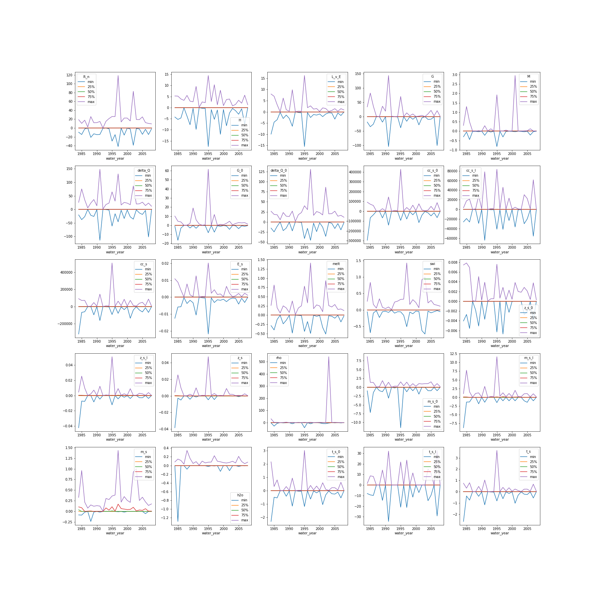

# PySnobal changelog

## Deviations from the original IPW Snobal and iSnobal

The original Snobal and iSnobal was written in C. The conversion to Python was implemented almost exactly as the original. However, C != Python so we have updated the model code to be more Pythonic. Below are some of the deviations from Snobal that will change model results or how it operates.

### Dry snow density

> Change performed in August 2020

The dry snow density is utilized in 2 places to calculate the maximum amount of water that can be held in the snowpack. The first is in `SnowState.init_layers()` when a new snowpack is generated. The equation to determine the dry snow density (`pysnobal.core.snow.dry_snow_density`) is:

```python
(rho - sat * RHO_W0) / (1 - sat * RHO_W0 / RHO_ICE)
```

where `rho` is the snow density, `sat` is the liquid water content as volume ratio. This was based on equations in Colbeck 1978 and Davis et al, 1985. However, in `runoff` it uses a simpler equation

```python
(m_s - h2o_total) / z_s
```

The `h2o_total` can be greater than `h2o_max` or the maximum water content of the snowpack (`h2o_sat` > 1). Modifying the `runoff` to use the `dry_snow_density` changes the model results slightly. The main difference is the `h2o` of the snowpack and `swi` timing. The figure below has the `min`, `25%`, `50%`, `75%`, `max` of the differences for the 25 year RME dataset, ordered by year. Most of the time, the dry snow density is very similar, with the `25%`, `50%` and `75%` being centered close around 0. The `min` and `max` are larger due to the timing differences of snowpack melt out. While the values can be large with the energy variables, the mass and depth remain similar with little change.

